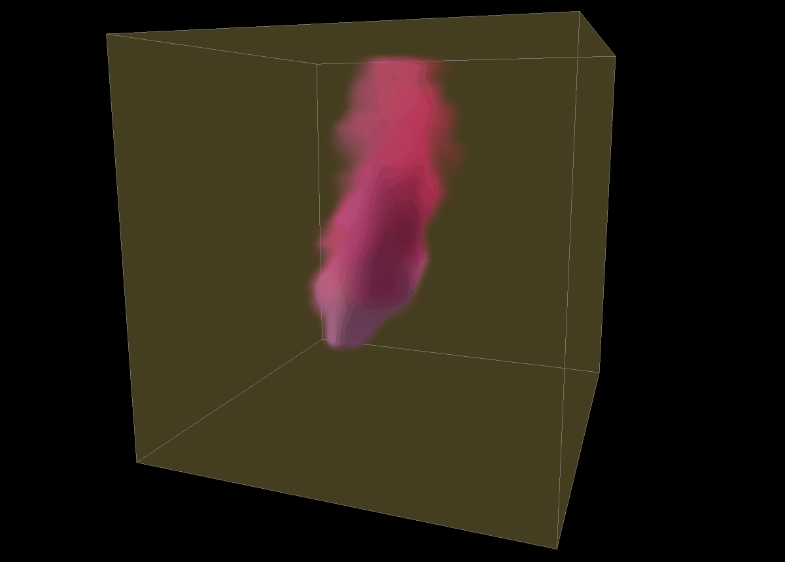

# Smoke Simulation

The smoke is an euler fluid implemented with a 3D grid & rendered using volume ray casting

### Dependencies	
- OpenGL
- GLM
- GLEW
- GLFW

### Credits
- This project is a modified fork of [SmokeSimulation](https://github.com/nevermoe/SmokeSimulation) by [nevermoe](https://github.com/nevermoe)